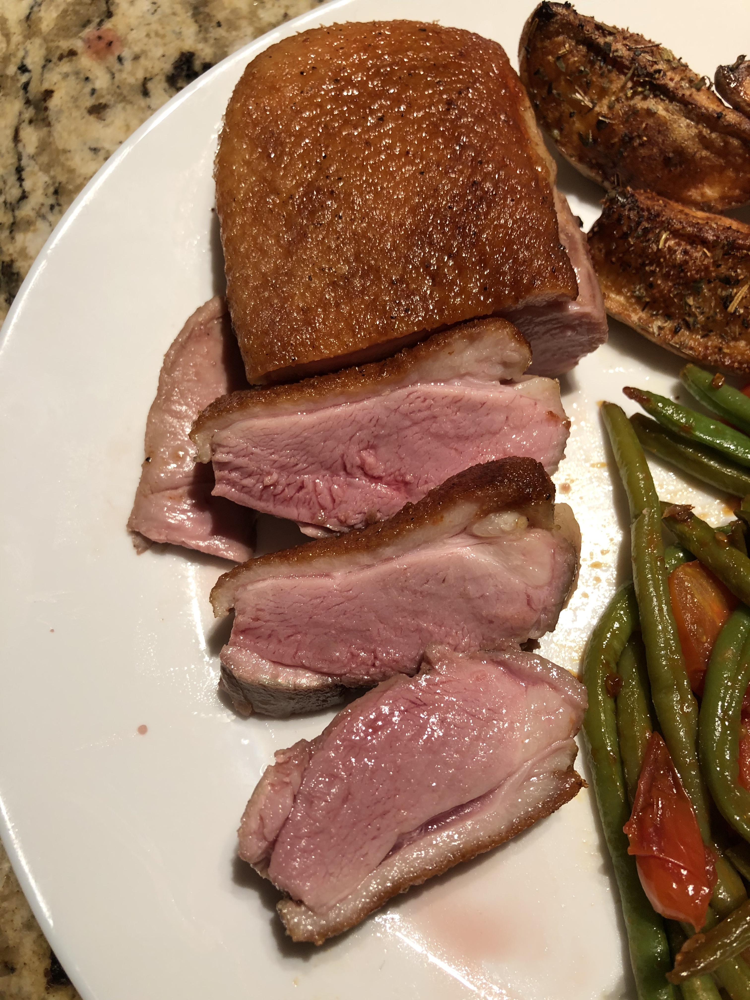

### 2020/02/29 First Attempt

- **Temperature:** 135 F
- **Time:** approx. 2hrs
- Seared in cast iron - skin could be crispier
- [Serious eats recipe](https://www.seriouseats.com/recipes/2010/09/sous-vide-101-duck-breast-recipe.html)
- Really tender and juicy, perfect temperature

