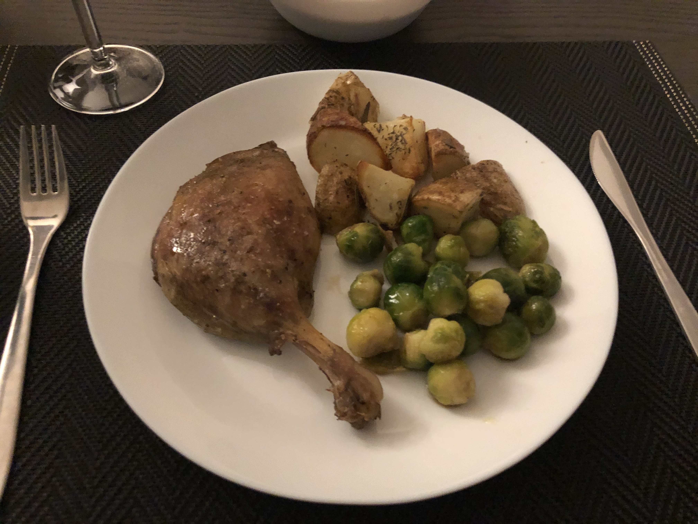

### Notes
- [Serious Eats article](https://www.seriouseats.com/2017/12/how-to-make-sous-vide-duck-confit.html)

### 2020/02/18

- **Temperature:** 135 F
- **Time:** approx. 2hrs
- [Serious eats recipe](https://www.seriouseats.com/recipes/2017/12/sous-vide-duck-confit-recipe.html)
- Finished in broiler - could have been longer for crispier skin
- Meat was very tender and fall-off-the-bone

