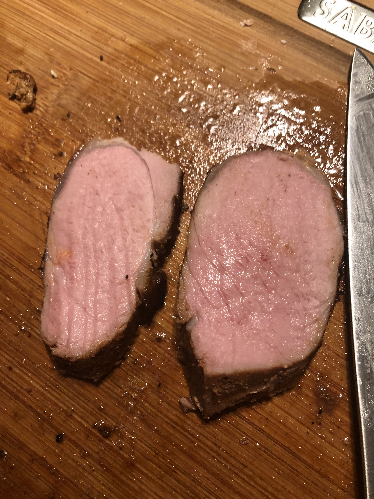

### Notes
- [Serious Eats article](https://www.seriouseats.com/2016/07/food-lab-complete-guide-sous-vide-pork-tenderloin.html)

### 2020/02/02

- **Temperature:** 142 F
- **Time:** approx. 2hrs
- Seared on cast iron, made pan sauce after with drippings, chicken bouillon, butter+flour roux
- Juicy and very tender

